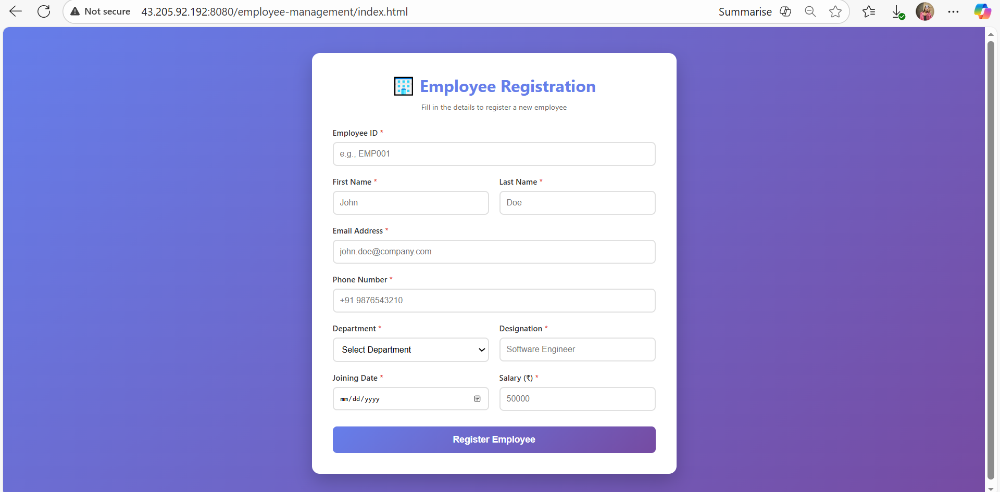
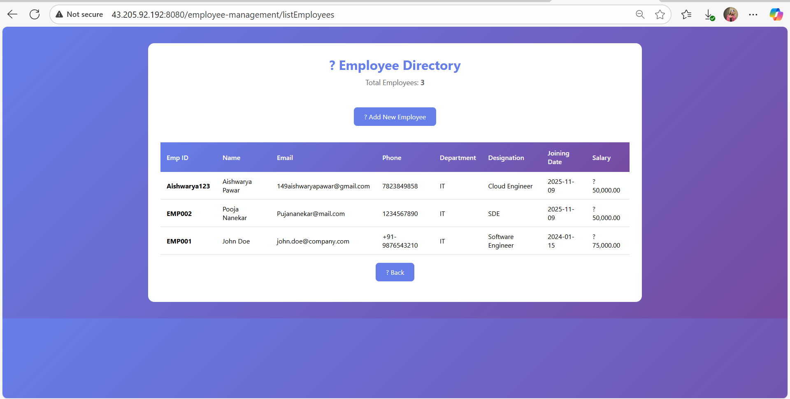
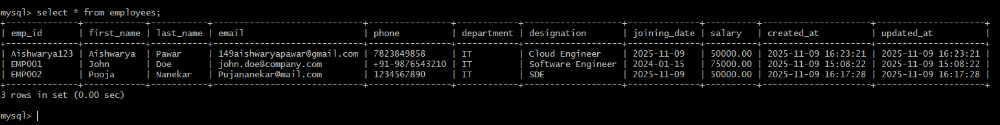

# Employee Management System (Java + Tomcat + MySQL + Jenkins CI/CD)

###  Project Overview

The **Employee Management System** is a web-based Java application built using Servlets and JSP, deployed on an **Apache Tomcat Server**. The system allows users to **register new employees**, view all registered employees, and store their data securely in a **MySQL database**.

---

###  Tech Stack

* **Frontend:** HTML, CSS, JSP
* **Backend:** Java Servlets
* **Database:** MySQL (RDS)
* **Server:** Apache Tomcat 9
* **Build Tool:** Maven
* **CI/CD:** Jenkins
* **Hosting:** AWS EC2

---

###  Folder Structure

```
employee-management-java/
├── src/main/java/com/employee/servlet/
│   ├── EmployeeServlet.java
│   ├── ListEmployeeServlet.java
│
├── src/main/webapp/
│   ├── index.html
│   ├── listEmployees.jsp
│   ├── WEB-INF/web.xml
│
├── pom.xml
├── Jenkinsfile
└── README.md
```

---

###  Features

✅ Employee Registration Form (Frontend UI)
✅ Stores Employee Data in MySQL Database
✅ Displays Employee List with all Details
✅ Jenkins Automated Build and Deployment Pipeline
✅ Runs on Apache Tomcat 9 via CI/CD

---

###  Jenkins CI/CD Pipeline Flow

1. **Checkout Code** – Fetches the latest code from GitHub.
2. **Build Stage** – Uses Maven to package the WAR file.
3. **Deploy Stage** – Copies the WAR file to the remote Tomcat server.
4. **Restart Tomcat** – Automatically restarts the service.
5. **Verification** – Checks if the application is running successfully.

---

###  Deployment Details

* **EC2 IP:** `43.205.92.192`
* **App URL:** [http://43.205.92.192:8080/employee-management/](http://43.205.92.192:8080/employee-management/)
* **Database:** Amazon RDS (MySQL)

---

###  Screenshots

####  Employee Registration Page



####  Employee Directory View



####  MySQL Employee Table



---

###  Database Schema

```sql
CREATE TABLE employees (
    emp_id VARCHAR(20) PRIMARY KEY,
    first_name VARCHAR(50),
    last_name VARCHAR(50),
    email VARCHAR(100),
    phone VARCHAR(20),
    department VARCHAR(50),
    designation VARCHAR(50),
    joining_date DATE,
    salary DECIMAL(10,2),
    created_at TIMESTAMP DEFAULT CURRENT_TIMESTAMP,
    updated_at TIMESTAMP DEFAULT CURRENT_TIMESTAMP ON UPDATE CURRENT_TIMESTAMP
);
```

---

###  Jenkinsfile Summary

```groovy
pipeline {
    agent any
    environment {
        SERVER_IP = '43.205.92.192'
        SSH_CRED_ID = 'node-app-key'
        TOMCAT_PATH = '/opt/tomcat9/webapps'
        TOMCAT_SVC = 'tomcat9'
    }
    stages {
        stage('Checkout') {
            steps { git branch: 'main', url: 'https://github.com/AishwaryaPawar149/employee-management-java.git' }
        }
        stage('Build WAR') {
            steps { sh 'mvn clean package' }
        }
        stage('Deploy') {
            steps {
                sshagent([SSH_CRED_ID]) {
                    sh '''scp -o StrictHostKeyChecking=no target/*.war ubuntu@${SERVER_IP}:/tmp/
                    ssh -o StrictHostKeyChecking=no ubuntu@${SERVER_IP} '
                        sudo mv /tmp/*.war ${TOMCAT_PATH}/employee-management.war
                        sudo chown ubuntu:ubuntu ${TOMCAT_PATH}/employee-management.war
                        sudo /opt/tomcat9/bin/shutdown.sh || true
                        sudo /opt/tomcat9/bin/startup.sh
                    '
                    '''
                }
            }
        }
    }
}
```

---

###  Result

 Successfully deployed on AWS EC2 instance using Jenkins CI/CD.
 Application accessible through browser and connected with RDS MySQL.
 Automated pipeline ensures continuous integration and deployment.

---

###  Author

**Aishwarya Pawar**
 [GitHub: AishwaryaPawar149](https://github.com/AishwaryaPawar149)

---

###  Keywords

AWS EC2 | Jenkins | Tomcat 9 | MySQL RDS | Maven | Java | CI/CD | Servlet | WebApp | Cloud Project
